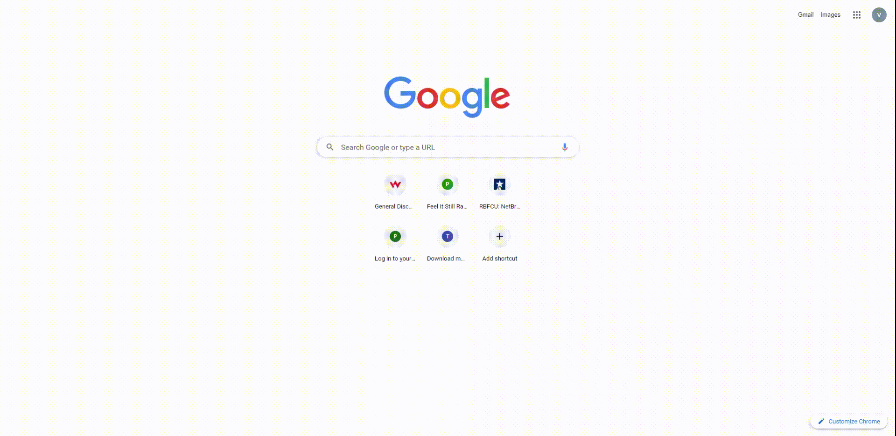

# Note-Saver

 
___
## Description
An application called Note Saver that can be used to write and save notes. This application uses Express.js back end and will save and retrieve note data from a JSON file.
___
## Table of Contents
* [Installation](#installation)
* [Usage](#usage)
* [License](#license)
* [Deployment](#deployment)
* [Questions?](#questions)
___
## Demo

Or check the [YouTube](https://youtu.be/T_1iR2g9y-4)

___
## Installation
No installation is required.
___
## Usage
Navigate on your browser to: [Note-Saver](https://rocky-refuge-14476.herokuapp.com/).

 By clicking 'Get Started' button, User will be redirected to the Notes page. On the left column are shown the saved Notes. By clicking on any of the notes, the contents will be shown on the main(right) column. Clicking on the delete(trash bin) icon, the note will be removed. To add a new note, click on the add(plus) icon at the top-right of the page and add the note title and the description in the coresponding fileds. When done, just click on the save(floppy-disk) icon next to the add button.

**Important:** _The notes **Can Not** be edited once they are saved!_

___
## License
[MIT](https://choosealicense.com/licenses/)
___
## Deployment
View the deployed page at : [Note-Saver](https://rocky-refuge-14476.herokuapp.com/)

View the Repo at : [Github](https://github.com/vitokwolf/Note-Saver)
___
## Questions?
Contact Me:
* Github: https://github.com/vitokwolf
* Email: sinajeen@gmail.com
